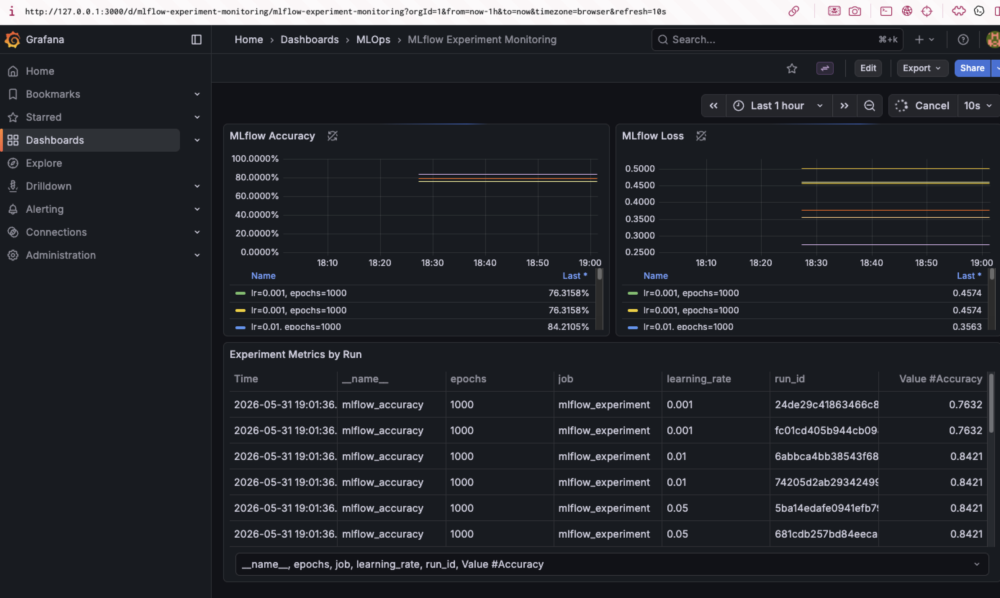

# Lesson 9: MLflow Experiments Monitoring

Домашнє завдання з MLOps: MLflow Tracking Server, MinIO, PostgreSQL, PushGateway, Prometheus і Grafana розгортаються декларативно через ArgoCD. Python-скрипт запускає серію ML-експериментів на Iris dataset, логує параметри, метрики й модель у MLflow, пушить `mlflow_accuracy` та `mlflow_loss` у PushGateway, а найкращу модель копіює в `best_model/`.

Гілка для перевірки: [lesson-9](https://github.com/vdubyna/go-it-ai-ml/tree/lesson-9).

## Що Реалізовано

- `MinIO` для MLflow artifacts, bucket `mlflow-artifacts`;
- `PostgreSQL` для backend store MLflow, база `mlflow`;
- `MLflow Tracking Server`, `ClusterIP`, порт `5000`;
- `Prometheus PushGateway`, namespace `monitoring`, `ClusterIP`, порт `9091`;
- `Prometheus`, який scrape-ить PushGateway;
- `Grafana` з datasource `Prometheus` і готовим dashboard-ом;
- `train_and_push.py`, який тренує кілька моделей, логує runs у MLflow, пушить метрики й копіює найкращу модель.

## Структура

```text
mlops-experiments/
├── argocd/
│   └── applications/
│       ├── grafana.yaml
│       ├── mlflow.yaml
│       ├── minio.yaml
│       ├── postgres.yaml
│       ├── prometheus.yaml
│       └── pushgateway.yaml
├── experiments/
│   ├── .env.example
│   ├── requirements.txt
│   └── train_and_push.py
├── best_model/
│   └── model/
└── screenshots/
```

## Розгортання Через ArgoCD

Маніфести Application лежать у:

```text
lesson-9/mlops-experiments/argocd/applications
```

Якщо ArgoCD встановлено Terraform-ом з `lesson-7`, root Application має дивитись на цю папку:

```text
repoURL: https://github.com/vdubyna/go-it-ai-ml.git
targetRevision: lesson-9
path: lesson-9/mlops-experiments/argocd
directory.recurse: true
```

Команда для оновлення root Application через Terraform:

```bash
cd lesson-7/terraform/argocd
terraform apply \
  -var="app_repo_branch=lesson-9" \
  -var="app_repo_path=lesson-9/mlops-experiments/argocd"
```

Якщо потрібно примусово оновити ArgoCD після push:

```bash
kubectl -n infra-tools annotate application goit-argo-root \
  argocd.argoproj.io/refresh=hard --overwrite
```

## Перевірка Кластера

ArgoCD applications:

```bash
kubectl get applications -n infra-tools
```

Очікуваний стан:

```text
goit-argo-root    Synced    Healthy
grafana           Synced    Healthy
minio             Synced    Healthy
mlflow            Synced    Healthy
mlflow-postgres   Synced    Healthy
prometheus        Synced    Healthy
pushgateway       Synced    Healthy
```

Pods:

```bash
kubectl get pods -n application
kubectl get pods -n monitoring
```

Services:

```bash
kubectl get svc -n application
kubectl get svc -n monitoring
```

Очікувані сервіси:

```text
application/mlflow-tracking                  ClusterIP  5000
application/minio                            ClusterIP  9000,9001
application/mlflow-postgres-postgresql       ClusterIP  5432
monitoring/pushgateway                       ClusterIP  9091
monitoring/prometheus-server                 ClusterIP  9090
monitoring/grafana                           ClusterIP  80
```

## Port-forward

MLflow UI:

```bash
kubectl port-forward -n application svc/mlflow-tracking 5000:5000
```

Якщо локальний порт `5000` зайнятий, можна використати `5500`:

```bash
kubectl port-forward -n application svc/mlflow-tracking 5500:5000
```

MinIO API:

```bash
kubectl port-forward -n application svc/minio 9000:9000
```

PushGateway:

```bash
kubectl port-forward -n monitoring svc/pushgateway 9091:9091
```

Prometheus:

```bash
kubectl port-forward -n monitoring svc/prometheus-server 9090:9090
```

Grafana:

```bash
kubectl port-forward -n monitoring svc/grafana 3000:80
```

Локальні адреси:

```text
MLflow UI:    http://localhost:5000
PushGateway:  http://localhost:9091
Prometheus:   http://localhost:9090
Grafana:      http://localhost:3000
```

Grafana credentials:

```text
username: admin
password: admin
```

## Запуск Експериментів

```bash
cd lesson-9/mlops-experiments/experiments
python3 -m venv .venv
source .venv/bin/activate
pip install -r requirements.txt
cp .env.example .env
python train_and_push.py
```

Для локального запуску через port-forward у `.env`:

```env
MLFLOW_TRACKING_URI=http://localhost:5000
PUSHGATEWAY_URL=http://localhost:9091
AWS_ACCESS_KEY_ID=minio
AWS_SECRET_ACCESS_KEY=minio123
MLFLOW_S3_ENDPOINT_URL=http://localhost:9000
```

Якщо MLflow port-forward зроблений на `5500:5000`, використовуйте:

```env
MLFLOW_TRACKING_URI=http://localhost:5500
```

Для запуску з pod-а всередині Kubernetes:

```env
MLFLOW_TRACKING_URI=http://mlflow-tracking.application.svc.cluster.local:5000
PUSHGATEWAY_URL=http://pushgateway.monitoring.svc.cluster.local:9091
MLFLOW_S3_ENDPOINT_URL=http://minio.application.svc.cluster.local:9000
AWS_ACCESS_KEY_ID=minio
AWS_SECRET_ACCESS_KEY=minio123
```

Після успішного запуску найкраща модель зберігається тут:

```text
lesson-9/mlops-experiments/best_model/model/
```

У поточному тестовому запуску найкращий run:

```text
run_id:        5ba14edafe0941efb792a0f182cfa482
learning_rate: 0.05
epochs:        1000
accuracy:      0.8421
loss:          0.2742
```

## Перевірка MLflow

Відкрийте MLflow UI:

```text
http://localhost:5000
```

Або, якщо використовується локальний порт `5500`:

```text
http://localhost:5500
```

У experiment `Iris Quality Monitoring` мають бути runs з:

- params: `learning_rate`, `epochs`, `dataset`;
- metrics: `accuracy`, `loss`;
- artifacts: `model/`.

Перевірка через API:

```bash
curl "http://localhost:5000/api/2.0/mlflow/experiments/get-by-name?experiment_name=Iris%20Quality%20Monitoring"
```

Якщо MLflow працює на локальному `5500`, замініть порт у команді.

## Перевірка PushGateway

```bash
curl http://localhost:9091/metrics | grep mlflow_
```

Очікувані метрики:

```text
mlflow_accuracy
mlflow_loss
```

## Перевірка Prometheus

Prometheus UI:

```text
http://localhost:9090
```

PromQL-запити:

```promql
mlflow_accuracy
mlflow_loss
```

Перевірка через API:

```bash
curl "http://localhost:9090/api/v1/query?query=mlflow_accuracy"
curl "http://localhost:9090/api/v1/query?query=mlflow_loss"
```

Target PushGateway можна перевірити тут:

```text
http://localhost:9090/targets
```

## Перевірка Grafana

Grafana UI:

```text
http://localhost:3000
```

Login:

```text
admin / admin
```

Datasource `Prometheus` створюється автоматично.

Для ручної перевірки відкрийте:

```text
Explore -> Prometheus
```

І виконайте запити:

```promql
mlflow_accuracy
mlflow_loss
```

Також автоматично створено dashboard:

```text
Dashboards -> MLOps -> MLflow Experiment Monitoring
```

Пряме посилання після port-forward:

```text
http://localhost:3000/d/mlflow-experiment-monitoring/mlflow-experiment-monitoring?orgId=1
```

Dashboard містить:

- `MLflow Accuracy` - графік accuracy по run-ах;
- `MLflow Loss` - графік loss по run-ах;
- `Experiment Metrics by Run` - таблиця з labels `run_id`, `learning_rate`, `epochs`.

Якщо графіки порожні, встановіть time range `Last 1 hour` або `Last 6 hours` і натисніть refresh.

## Скриншоти Для Здачі

Додайте скриншоти в папку `screenshots/`:

```text
lesson-9/mlops-experiments/screenshots/mlflow-ui.png
lesson-9/mlops-experiments/screenshots/grafana-explore.png
lesson-9/mlops-experiments/screenshots/grafana-dashboard.jpg
```

Поточний скриншот Grafana dashboard:



У LMS можна додати:

- скриншот MLflow experiment `Iris Quality Monitoring`;
- скриншот Grafana Explore з `mlflow_accuracy` або `mlflow_loss`;
- скриншот dashboard `MLflow Experiment Monitoring`;
- посилання на гілку `lesson-9`.

## Формат Здачі

Для LMS:

```text
ДЗ8_Прізвище_Імʼя.zip
```

У відповіді додайте посилання на гілку:

```text
https://github.com/vdubyna/go-it-ai-ml/tree/lesson-9
```

## Cleanup

Після перевірки видаліть платні ресурси:

```bash
cd lesson-7/terraform/argocd
terraform destroy

cd ../eks
terraform destroy
```

Якщо S3 bucket використовується для Terraform state, його можна залишити. Вартість S3 залежить від обсягу збережених даних.
